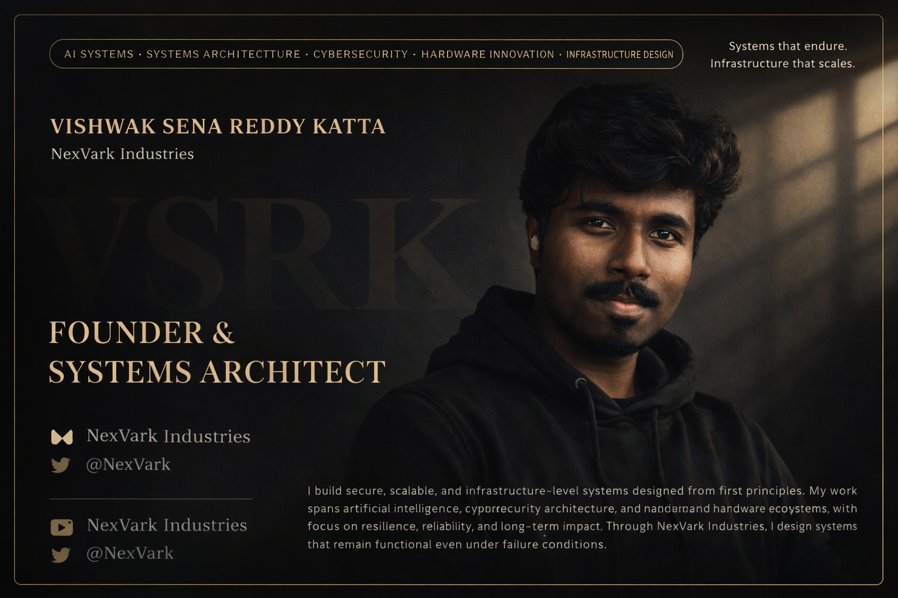

  

<h1 align="center">Katta Vishwak Sena Reddy</h1>

  <b>Builder • Founder • Product Engineer</b> 
  Architecting systems. Engineering execution.

  

---

## 🧠 Dashboard of Operations & Product Engineering

  

A unified command center to manage my studies, projects, and startup progress—turning ideas into execution and measurable results.

---

## ⚙️ Core Systems

  
  
  
  

- 📚 **Studies Engine** → Structured learning & knowledge tracking  
- ⚡ **Project Pipeline** → Build, test, deploy systems  
- 🚀 **Startup Ops** → Execution, growth, and scaling  
- 🧠 **Innovation Lab** → New ideas, experiments, prototypes  

---

## 🛠 Tech Stack

  

---

## 🚀 Current Focus

  

- Building **TapDrive & TapPod ecosystem**
- Developing **Marvin AI (Jarvis-level system)**
- Creating **StackHeal AI**
- Engineering real-world **Iron Man suit systems**

---

## 📊 GitHub Intelligence

  
  

---

## ⚡ System Philosophy

  

> Build what others think is impossible.  
> Engineer clarity. Execute relentlessly.

---

## 🌐 Connect

  

- GitHub: https://github.com/yourusername  
- LinkedIn: (add if you want)  
- Email: (optional)
